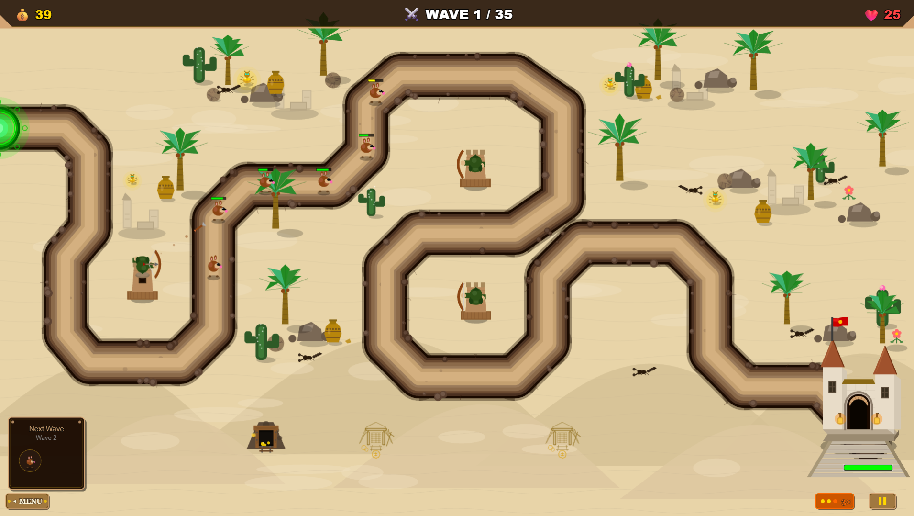

<p align="center">
  
</p>

<h1 align="center">🏰 Desert Guardians</h1>

<p align="center">
  <strong>A tower defense game built entirely through AI collaboration — zero manual coding.</strong>
</p>

<p align="center">
  
  
  
  
</p>

<p align="center">
  <a href="#-play-now">Play Now</a> •
  <a href="#-about">About</a> •
  <a href="#-the-experiment">The Experiment</a> •
  <a href="#-features">Features</a> •
  <a href="#-towers">Towers</a> •
  <a href="#-installation">Installation</a>
</p>

---

## 🎮 Play Now

**[🏰 Play Desert Guardians](https://iceweb.ch/dg/)** — No download required!

Defend your castle against 35 waves of enemies. Can you reach the global leaderboard?

---

## 📖 About

**Desert Guardians** is an Egyptian/desert-themed tower defense game where you defend your castle against waves of increasingly dangerous creeps. Build towers, upgrade your defenses, manage gold mines, and survive all 35 waves to claim victory.

But here's the twist: **not a single line of code was written manually**.

This project continues an experiment to stress test how far today's Gen AI models can really go in software development.

> *"Zero manual coding. 100% vibe coding."*

---

## 🧪 The Experiment

### The Goal
Build a complete, polished browser game — including a global leaderboard backend — **without writing any code manually**. Just pure AI collaboration.

### The Evolution

| Project | Type | Model | Result |
|:--------|:-----|:------|:-------|
| **Swiss Adventure** | Platformer (Python/Pygame) | Claude Opus 3 | ✅ Full game with global scores |
| **Desert Guardians** | Tower Defense (TypeScript/Phaser) | Claude Opus 4 | ✅ Complex strategy game with 7 tower branches, 35 waves, global leaderboard |

### Why Tower Defense?

Tower defense games are significantly more complex than platformers:
- **Strategic depth** — Multiple tower types with upgrade paths and special abilities
- **Enemy variety** — Different creep abilities (armor, shields, flying, jumping, bosses)
- **Resource management** — Gold economy, tower selling, gold mines
- **Balancing** — 35 waves of carefully tuned difficulty progression
- **State management** — Tracking dozens of entities simultaneously

> *"If AI can build a tower defense game, it can build most business applications."*

---

## ✨ Features

### 🏰 Core Gameplay
- **35 Waves** of increasingly difficult enemies
- **7 Tower Branches** with up to 4 upgrade levels and special abilities
- **Gold Mine System** — Build and upgrade mines for passive income
- **Castle Defense** — Protect your 25 HP from leaking creeps
- **Special Wave Types** — Flying, Digger, Ghost, Broodmother, Flame, Plaguebearer, Chaos
- **Elemental Immunities** — Flame enemies only take Ice damage; Plaguebearers only take Poison
- **Victory & Defeat** — All runs can submit to the global leaderboard

### 🎯 Strategic Elements
- **Tower Placement** — Strategic positioning matters
- **Upgrade Decisions** — Level up towers for increased power
- **Gold Management** — Balance between towers and gold mines
- **Wave Previews** — See what's coming next to prepare your defense
- **Post-Game Review Mode** — Click towers after a run to review stats and strategy

### 🏆 Scoring System
- **Wave Bonus** — 100 points per wave reached
- **Gold Bonus** — 0.2× total gold earned
- **HP Bonus** — 100 points per HP remaining
- **Time Multiplier** — Up to 1.5× for fast completion

### 🌐 Global Competition
- **Global Leaderboard** — Top 20 scores worldwide
- **Local Scores** — Offline fallback with localStorage
- **Anti-Cheat** — Server-side score validation

### 🎨 Polish
- Egyptian/desert themed graphics
- Animated tower attacks and creep movements
- Particle effects and visual feedback
- Background music and sound effects
- Castle destruction animation on defeat

---

## 🗼 Towers

All towers start as **Archer Tower** and can branch into specialized paths at level 2. Each branch upgrades to level 4 and gains a set of special abilities that can proc during combat (Aura abilities are passive).

| Tower | Type | Specialty | Signature Abilities |
|:------|:-----|:----------|:--------------------|
| 🏹 **Archer** | Physical | Balanced damage, +200% vs air | Multi-Shot, Piercing Arrow, Quick Draw |
| ⚡ **Rapid Fire** | Physical | Extreme attack speed | Bullet Storm, Ricochet, Incendiary Rounds |
| 🎯 **Sniper** | Physical | High damage, long range | Critical Strike, Armor Pierce, Headshot |
| 💣 **Rock Cannon** | Physical | Splash damage (70-110px) | Aftershock, Earthquake, Shrapnel Burst |
| ❄️ **Ice Tower** | Magic | Slows enemies 40-65% | Ice Trap, Frost Nova, Shatter |
| ☠️ **Poison Tower** | Magic | DoT, ignores armor | Plague Spread, Toxic Explosion, Corrosive Acid |
| ✨ **Aura Tower** | Support | Buffs nearby towers 20-50% | War Cry, Critical Aura, Overcharge |

---

## 👾 Enemies

| Type | Ability |
|:-----|:--------|
| **Furball** | Basic creep |
| **Runner** | Very fast but fragile |
| **Tank** | High HP, slow, armored |
| **Shielded** | Blocks the first few hits |
| **Jumper** | Leaps past towers every few seconds |
| **Flying** | Air units; **immune to Rock Cannon and Poison** |
| **Digger** | Burrows underground, invulnerable while digging |
| **Ghost** | Phases out when low HP |
| **Broodmother** | Spawns baby creeps on death |
| **Baby** | Small, fast, weak |
| **Flame** | **Only damaged by Ice Towers** |
| **Plaguebearer** | **Only damaged by Poison Towers** |
| **Bosses** | Multiple boss tiers with dispel mechanics |
| **Boss Guards** | Shielded elite escorts for late-game bosses |

---

## 💻 Installation

### Option 1: Play Online (Recommended)
Visit **[https://iceweb.ch/dg/](https://iceweb.ch/dg/)** — works in any modern browser!

### Option 2: Run Locally

```bash
# Clone the repository
git clone https://github.com/mikeblochlevermore/desert-guardians.git
cd desert-guardians

# Install dependencies
npm install

# Start development server
npm run dev

# Build for production
npm run build
```

### Requirements
- Node.js 20+
- npm or pnpm

---

## 📁 Project Structure

```
Desert Guardians/
├── src/
│   ├── main.ts              # Entry point
│   ├── data/                # Game configuration & tower data
│   ├── graphics/            # Tower and creep animations
│   ├── managers/            # Core game systems
│   │   ├── WaveManager.ts   # Wave spawning logic
│   │   ├── TowerManager.ts  # Tower placement & upgrades
│   │   ├── CreepManager.ts  # Enemy management
│   │   ├── CombatManager.ts # Targeting & damage
│   │   └── HighscoreAPI.ts  # Global leaderboard client
│   ├── objects/             # Game entities (towers, creeps, projectiles)
│   └── scenes/              # Phaser scenes (Menu, Game, Results)
├── public/
│   └── assets/              # Images, audio, maps
├── server/                  # Backend API (PHP)
│   ├── api.php              # Highscore endpoints
│   ├── config.template.php  # Configuration template
│   └── init_db.php          # Database setup
└── docs/                    # Design documents
```

---

## 🔧 Server Setup (For Self-Hosting)

1. Copy `server/config.template.php` to `server/config.php`
2. Update database credentials and secret key
3. Upload `server/` folder to your PHP host
4. Run `init_db.php` once to create tables
5. Delete `init_db.php` from server
6. Update `API_URL` in `src/managers/HighscoreAPI.ts`

---

## 💡 Food for Thought

This project demonstrates that **complex, strategic games** can be built through AI collaboration:

- A tower defense game involves more moving parts than many business applications
- The codebase is clean, maintainable, and follows best practices
- Bug fixing was fast — most issues resolved in 1-2 prompts
- The development experience was **genuinely fun**

> *"If your team isn't experimenting with AI-assisted development, you're leaving productivity on the table."*

---

## 📝 License

This project is open source and available under the [MIT License](LICENSE).

---

## 👤 Author

**Mike Blöchlinger**

- This game was created as an experiment in AI-assisted development
- © 2026 Mike Blöchlinger

---

<p align="center">
  
</p>

<p align="center">
  <strong>🏜️ Built in the desert... by AI 🤖</strong>
</p>
