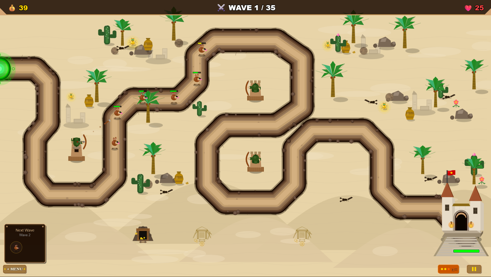

<p align="center">
  
</p>

<h1 align="center">🏰 Desert Guardians</h1>

<p align="center">
  <strong>A tower defense game built entirely through AI collaboration — zero manual coding.</strong>
</p>

<p align="center">
  
  
  
  
</p>

<p align="center">
  <a href="#-play-now">Play Now</a> •
  <a href="#-about">About</a> •
  <a href="#-the-experiment">The Experiment</a> •
  <a href="#-features">Features</a> •
  <a href="#-towers">Towers</a> •
  <a href="#-installation">Installation</a>
</p>

---

## 🎮 Play Now

**[🏰 Play Desert Guardians](https://iceweb.ch/dg/)** — No download required!

Defend your castle against 35 waves of enemies. Can you reach the global leaderboard?

---

## 📖 About

**Desert Guardians** is an Egyptian/desert-themed tower defense game where you defend your castle against waves of increasingly dangerous creeps. Build towers, upgrade your defenses, manage gold mines, and survive all 35 waves to claim victory.

But here's the twist: **not a single line of code was written manually**.

This project continues an experiment to stress test how far today's Gen AI models can really go in software development.

> *"Zero manual coding. 100% vibe coding."*

---

## 🧪 The Experiment

### The Goal
Build a complete, polished browser game — including a global leaderboard backend — **without writing any code manually**. Just pure AI collaboration.

### The Evolution

| Project | Type | Model | Result |
|:--------|:-----|:------|:-------|
| **Swiss Adventure** | Platformer (Python/Pygame) | Claude Opus 3 | ✅ Full game with global scores |
| **Desert Guardians** | Tower Defense (TypeScript/Phaser) | Claude Opus 4 | ✅ Complex strategy game with 7 tower branches, 35 waves, global leaderboard |

### Why Tower Defense?

Tower defense games are significantly more complex than platformers:
- **Strategic depth** — Multiple tower types with upgrade paths and special abilities
- **Enemy variety** — Different creep abilities (armor, shields, flying, jumping, bosses)
- **Resource management** — Gold economy, tower selling, gold mines
- **Balancing** — 35 waves of carefully tuned difficulty progression
- **State management** — Tracking dozens of entities simultaneously

> *"If AI can build a tower defense game, it can build most business applications."*

---

## ✨ Features

### 🏰 Core Gameplay
- **3 Difficulty Levels** — Easy (75% enemy HP), Normal, Hard (125% enemy HP)
- **35 Waves** of increasingly difficult enemies
- **7 Tower Branches** with up to 4 upgrade levels and special abilities
- **Gold Mine System** — Build and upgrade mines for passive income
- **Castle Defense** — Protect your 25 HP from leaking creeps
- **Special Wave Types** — Flying, Digger, Ghost, Broodmother, Flame, Plaguebearer, Chaos
- **Elemental Immunities** — Flame enemies only take Ice damage; Plaguebearers only take Poison
- **Victory & Defeat** — All runs can submit to the global leaderboard

### 🎯 Strategic Elements
- **Tower Placement** — Strategic positioning matters
- **Upgrade Decisions** — Level up towers for increased power
- **Gold Management** — Balance between towers and gold mines
- **Wave Previews** — See what's coming next to prepare your defense
- **Post-Game Review Mode** — Click towers after a run to review stats and strategy

### 🏆 Scoring System
- **Wave Bonus** — 100 points per wave completed
- **Gold Bonus** — 0.2× total gold earned
- **HP Bonus** — 100 points per HP remaining
- **Time Bonus** — Victory only! +1.5 points per second under 80 minutes (max 3000 pts)
- **Difficulty Multiplier** — Easy ×0.75, Normal ×1.0, Hard ×1.25
- **Global Rank Display** — See where you place among all players

### 🌐 Global Competition
- **Global Leaderboard** — Top 20 scores worldwide
- **Local Scores** — Offline fallback with localStorage
- **Anti-Cheat** — Server-side score validation

### 🎨 Polish
- Egyptian/desert themed procedural graphics (no sprite assets)
- Animated tower attacks and creep movements
- Particle effects and visual feedback
- Background music and sound effects
- Castle destruction animation on defeat

### 🏗️ Architecture
- **Event-driven design** — Decoupled systems via GameEventBus
- **Context-aware input** — InputSystem handles keyboard/mouse based on game state
- **Modular components** — Split large files into focused, testable modules
- **545 unit tests** — Comprehensive test coverage with Vitest

---

## 🗼 Towers

All towers start as **Archer Tower** and can branch into specialized paths at level 2. Each branch upgrades to level 4 and gains a set of special abilities that can proc during combat (Aura abilities are passive).

| Tower | Type | Specialty | Signature Abilities |
|:------|:-----|:----------|:--------------------|
| 🏹 **Archer** | Physical | Balanced damage, +200% vs air | Multi-Shot, Piercing Arrow, Exploit Weakness |
| ⚡ **Rapid Fire** | Physical | Extreme attack speed, armor shred | Bullet Storm, Ricochet, Incendiary Rounds |
| 🎯 **Sniper** | Physical | High damage, long range | Critical Strike, Armor Pierce, Headshot |
| 💣 **Rock Cannon** | Physical | Splash damage (70-110px) | Aftershock, Tremor, Shrapnel Burst |
| ❄️ **Ice Tower** | Magic | Slows enemies, 80% armor pen | Ice Trap, Frost Nova, Deep Freeze |
| ☠️ **Poison Tower** | Magic | DoT, 80% armor pen, no air | Plague Spread, Toxic Explosion, Corrosive Acid |
| ✨ **Aura Tower** | Support | Buffs nearby towers 20-50% | War Cry, Critical Aura, Echo Amplify |

---

## 👾 Enemies

| Type | Ability |
|:-----|:--------|
| **Furball** | Basic creep |
| **Runner** | Very fast but fragile |
| **Tank** | High HP, slow, armored |
| **Shielded** | Blocks the first few hits |
| **Jumper** | Leaps past towers every few seconds |
| **Flying** | Air units; **immune to Rock Cannon and Poison** |
| **Digger** | Burrows underground, invulnerable while digging |
| **Ghost** | Phases out when low HP |
| **Broodmother** | Spawns baby creeps on death |
| **Baby** | Small, fast, weak |
| **Flame** | **Only damaged by Ice Towers** |
| **Plaguebearer** | **Only damaged by Poison Towers** |
| **Bosses** | Multiple boss tiers with dispel mechanics |
| **Boss Guards** | Shielded elite escorts for late-game bosses |

---

## 💻 Installation

### Option 1: Play Online (Recommended)
Visit **[https://iceweb.ch/dg/](https://iceweb.ch/dg/)** — works in any modern browser!

### Option 2: Run Locally

```bash
# Clone the repository
git clone https://github.com/mikeblochlevermore/desert-guardians.git
cd desert-guardians

# Install dependencies
npm install

# Start development server
npm run dev

# Run tests
npm run test:run

# Run tests with coverage
npm run test:coverage

# Build for production
npm run build
```

### Requirements
- Node.js 20+
- npm or pnpm

---

## 📁 Project Structure

```
Desert Guardians/
├── src/
│   ├── main.ts              # Entry point
│   ├── __tests__/           # Unit tests (545 tests)
│   ├── data/                # Game configuration & tower data
│   ├── graphics/            # Tower and creep animations
│   │   ├── creeps/          # Creep renderers by type
│   │   │   └── bosses/      # Individual boss renderers
│   │   └── towers/          # Tower graphics by type
│   ├── managers/            # Core game systems
│   │   ├── WaveManager.ts   # Wave spawning logic
│   │   ├── TowerManager.ts  # Tower placement & upgrades
│   │   ├── CreepManager.ts  # Enemy management
│   │   ├── CombatManager.ts # Targeting & damage
│   │   ├── GameEventBus.ts  # Type-safe event system
│   │   ├── InputSystem.ts   # Context-aware input handling
│   │   ├── SelectionManager.ts # Centralized selection state
│   │   ├── RenderOptimizer.ts  # Performance utilities
│   │   └── HighscoreAPI.ts  # Global leaderboard client
│   ├── objects/             # Game entities (towers, creeps, projectiles)
│   └── scenes/              # Phaser scenes
│       └── menu/            # Modular menu components
├── public/
│   └── assets/              # Audio files
├── server/                  # Backend API (PHP)
│   ├── api.php              # Highscore endpoints
│   ├── config.template.php  # Configuration template
│   └── init_db.php          # Database setup
└── docs/                    # Design documents
```

---

## 🔧 Server Setup (For Self-Hosting)

1. Copy `server/config.template.php` to `server/config.php`
2. Update database credentials and secret key
3. Upload `server/` folder to your PHP host
4. Run `init_db.php` once to create tables
5. Delete `init_db.php` from server
6. Update `API_URL` in `src/managers/HighscoreAPI.ts`

---

## 💡 Food for Thought

This project demonstrates that **complex, strategic games** can be built through AI collaboration:

- A tower defense game involves more moving parts than many business applications
- The codebase is clean, maintainable, and follows best practices
- Bug fixing was fast — most issues resolved in 1-2 prompts
- The development experience was **genuinely fun**

> *"If your team isn't experimenting with AI-assisted development, you're leaving productivity on the table."*

---

## 📝 License

This project is open source and available under the [MIT License](LICENSE).

---

## 📝 Changelog
### v2.1 — Quality of Life & UX Improvements

**Mine Income Countdown**
- **Collection Countdown** — After each wave ends, a 3-2-1 countdown (0.8s per number) appears near each built mine before income is collected. This gives players time to upgrade mines before the next income tick, rewarding tactical mine management.
- **Simultaneous Collection** — All mines now collect income at once after the countdown (previously staggered one-by-one).
- **Skipped When Empty** — If no mines are built, the countdown is skipped entirely.

**Countdown Timing**
- **Speed-Independent** — Both the mine countdown and wave countdown now tick at a fixed 0.8s per number (2.4s total), regardless of game speed (1×/2×/3×). Previously the wave countdown was affected by game speed.

**Tower Range Preview (Scroll Wheel)**
- **Default Preview** — Hovering over a valid placement spot shows the basic archer L1 range ring.
- **Multi-Branch Preview** — Scroll the mouse wheel to enter comparison mode: see all L1–L4 range rings for the current branch, then keep scrolling to cycle through all 7 branches.
- **Color-Coded Rings** — L1 = green, L2 = yellow, L3 = orange, L4 = cyan, with labels on each ring.
- **Branch Name Display** — The currently previewed tower branch name is shown above the placement position.
- **Scroll Hint** — A bobbing scroll-wheel icon appears the first time you enter placement mode, dismissed after first use.

**Wave-Only Scoring Timer**
- **Fair Time Bonus** — The scoring timer now only counts time during active waves (when creeps are on the field). Countdowns, mine collection delays, and idle time between waves no longer penalize the time bonus.
- **HUD Timer Unchanged** — The in-game clock still shows total elapsed time for reference.

**Archer Tower Renamed**
- Archer towers now display level numbers: Archer Tower → Archer 2 → Archer 3 → Archer 4.

**Aura Tower Range Buff**
- **L1 Range** — 90 → 100px (+11%), making early aura placement more forgiving.
- **L2 Range** — 105 → 120px (+14%).
- **L3 Range** — 120 → 130px (+8%).
- **L4 Range** — Unchanged at 140px.
- Smoother progression: 100 → 120 → 130 → 140.

**Simplified Pause Overlay**
- Removed the dark semi-transparent background from the pause screen. The "⏸ PAUSED" text now floats directly over the game, letting players still see the battlefield while paused.

### v2.0 — Late-Game Balance & Hardware-Independent Timing

**Difficulty Rebalance**
- **Wave Scaling Reduction** — HP scaling per wave reduced from 0.08 → 0.07, max HP multiplier 3.0 → 2.75. Armor scaling 0.04 → 0.035, max armor 2.0 → 1.85. Late-game creeps are ~8% easier across all difficulty modes.
- **Ice Tower Duration Buff** — Slow durations increased ~30% (L1: 2s→2.6s, L2: 2.5s→3.25s, L3: 3s→3.9s, L4: 3.5s→4.5s) to compensate for timing fix making them correctly tick in game time.
- **Poison Tower Duration Buff** — DoT durations increased ~25-30% (L1-2: 5s→6.5s, L3-4: 6s→7.5s) for the same reason — poison now deals correct total damage at all speeds.
- **Ice Ability Buff** — Ice Trap freeze 2s→2.6s, Deep Freeze brittle 2.5s→3.25s.
- **Gold Mine Income Buff** — Income rounded up to clean values (14→20, 22→30, 35→40, 58→60g per wave). ~450g extra gold over a full game with 3 mines, biggest impact in early game.

**Tower Balance — Archer & Rapid Fire rework**
- **Rapid Fire: Innate Armor Shred** — Every RF hit reduces a creep's armor (1/1.5/2/2.5 per hit by tower level, max 40 total). Shred persists on normal creeps but bosses dispel it every 15s, creating a shred→burst→reset cycle. *Stack RF towers on a chokepoint to shred armor before your snipers fire.*
- **Archer L4: Heavy Arrows → Exploit Weakness** — Replaced the marginal +50% damage ability with a conditional nuke: deals 2× magic damage to any debuffed target (slowed, poisoned, burning, etc.). *Pair archers with ice or poison towers to trigger Exploit Weakness consistently.*
- **Rapid Fire L4: Bullet Storm Buff** — Fires 8 shots (was 5) with +10% escalating damage per shot, rewarding sustained fire.
- **Rapid Fire L4: Incendiary Rounds Buff** — Burn DPS increased from 10 → 15 per stack (up to 3 stacks). Proc chance slightly raised.
- **Cost Rebalancing** — Archer L3 cost 280 → 240, Archer L4 cost 800 → 600 (total investment 1240 → 1000g). RF L4 cost 650 → 600 (total 1440 → 1390g). This makes Archer and RF noticeably cheaper than Sniper (1670g) and Cannon (1570g), reflecting their support role.
- **Armor Shred Cap** — Maximum armor reduction from all sources raised from 25 → 40, giving RF towers room to fully shred mid-tier armor.

**Hardware-Independent Timing**
- **Status Effects Fixed** — Slow, freeze, poison, burn, brittle, and immunity durations now use virtual game time instead of wall-clock time. Previously, ice/slow towers were ~3× weaker at 3× speed because effects expired in real seconds rather than game seconds. *Ice towers now slow for the same effective duration at any game speed.*
- **Wave Spawning Fixed** — Creep spawn intervals now use delta-accumulated timers instead of wall-clock `delayedCall`. Changing game speed mid-wave no longer causes spawn timing glitches.
- **Boss Rage Timing Fixed** — Boss 5's rage animation freeze now correctly uses game time, so it lasts the same in-game duration regardless of speed setting.
- **Scoring Unchanged** — The scoring timer already used virtual game time, which is the fairest option (identical gameplay = identical score regardless of hardware or speed).

**Strategy implications for players:**
- RF towers are no longer useless late-game — they're now one of the best support towers. Place 2-3 RF towers early on the path to pre-shred armor before creeps reach your snipers/cannons.
- Archer L4 with Exploit Weakness turns archers into burst damage towers when combined with any CC/debuff tower (ice, poison, or even other RF burn stacks).
- Ice towers are now equally effective at 1×, 2×, and 3× speed — slowed creeps stay slowed for the correct game-time duration at all speeds.
- Budget matters more: a fully upgraded Archer costs only 1000g vs Sniper's 1670g. Consider mixing cheap archers with expensive snipers instead of going all-sniper.

### v1.5 (January 26, 2026)
- **Flame Wave Nerf**: Reduced flame creep count (18→14), speed (90→80), health (24→22), and spawn interval (1000ms→1100ms)
- **Ice Tower Fix**: Ice towers no longer skip slowed flame creeps (damage source priority)
- **Rock Cannon Buff**: Damage increased ~25-30% across all tiers (Lv4: 58→75 damage)
- **Rock Cannon Abilities Buff**: Aftershock (50%→60%), Tremor (25→80 dmg), Shrapnel (35%→45%)
- **Boss Health Bar Fix**: Health bars now properly reset when creeps are reused from pool
### v1.0 (January 23, 2026)
- **Time Bonus Rework**: Changed from multiplier (×1.0-1.35) to additive bonus (+1.5 pts/sec under 40 min, max 3000 pts)
- **In-Game Timer**: Timer now uses game time (scales with 2×/3× speed) instead of real time
- **Timer Start**: Timer only begins when wave 1 starts, not when the game loads
- **Version Display**: Added version number to home screen and leaderboard
- **Auto-Versioning**: Build process auto-increments minor version number

---

## �👤 Author

**Mike Blöchlinger**

- This game was created as an experiment in AI-assisted development
- © 2026 Mike Blöchlinger

---

<p align="center">
  
</p>

<p align="center">
  <strong>🏜️ Built in the desert... by AI 🤖</strong>
</p>
